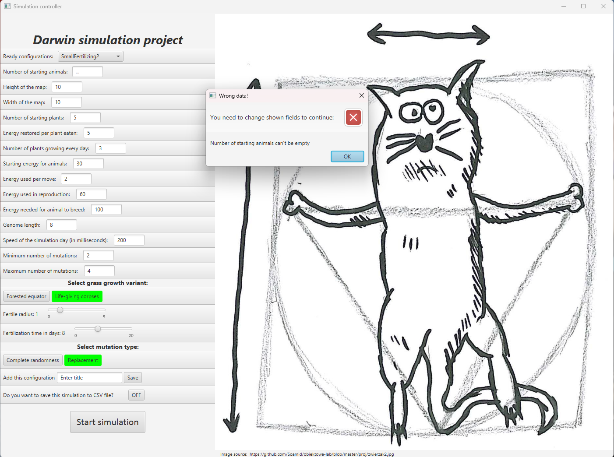

# Darwin Simulation Project
3rd semester - Java - Darwin Simulation Project - **AGH University of Krakow**

Used technologies: **Java and JavaFX**

Created by: **Przemysław Popowski**

## Introduction

The purpose of this application is to simulate the process of evolution based on natural selection principles described by **Charles Darwin**. The simulation models the behavior of animals in a dynamically changing environment, where they move, eat, reproduce, and evolve over time. Users can configure various simulation parameters, observe individual animals, and analyze genetic traits across generations. The application provides visualization of the simulation and allows for data tracking.

## Installation

<ol> 
    <li> Download and install JDK version 21 (e.g. OpenJDK or Oracle JDK) </li>
    - Set the <i>JAVA_HOME</i> environment variable pointing to the downloaded JDK 21 location
    <li> Clone the project repository from <i> github </i> </li>
    <b><i> - git clone https://github.com/przemuuu/Darwin_Simulation_Project.git </i></b>
    <li> Open IntelliJ IDEA, choose: File → Open… , then select the <b>Darwin_Simulation_Project</b> folder </li>
    <li>IntelliJ will automatically recognize your Gradle project. If not: right-click on the <b> build.gradle file → Link Gradle Project </b> </li>
    <li> Make sure JDK 21 is selected in your project settings: <b> File → Project Structure → SDK → select JDK 21</b> </li>
    <li> To start the application, go to <b> src → main → java → agh → ics → oop → World.java</b> and click the ▶ (Run) button in the upper right corner </li>
    <li> If the application started correctly, a controller window should appear on the screen  </li>
    - In case of any problems, check the IntelliJ or Gradle logs (e.g. missing dependencies)
</ol>

## Controller

The controller is responsible for managing the configuration of the simulation. It allows the user to choose a predefined setup or manually enter custom simulation parameters. Additionally, it provides options to save the selected configuration, enable CSV data export, and start the simulation.

 

### Configurations

 

### Parameters

 

<ul>
    <li>Number of starting animals</li>
    <li>Height of the map</li>
    <li>Width of the map</li>
    <li>Number of starting plants</li>
    <li>Energy restored per plant eaten</li>
    <li>Number of plants growing every day</li>
    <li>Starting energy for animals</li>
    <li>Energy used per move</li>
    <li>Energy used in reproduction</li>
    <li>Energy needed for animal to breed</li>
    <li>Genome length</li>
    <li>Speed of the simulation day (in ms)</li>
    <li>Minimum number of mutations (can't be greater than genome length)</li>
    <li>Maximum number of mutations (can't be greater than genome length)</li>
    <li>Grass growth variant</li>
    <ul>
        <li>Forested equator - the horizontal strip of fields in the central part of the map (mimicking the equator and surrounding areas) is preferred by plants</li>
        <li>Life-giving corpses - plants prefer to grow in fields where an animal has recently died</li>
    </ul>
    <li>Mutation type</li>
    <ul>
        <li>Complete randomness - mutation changes a gene to any other gene</li>
        <li>Replacement - a mutation can also result in two genes switching places</li>
    </ul>
    <li>Text field to enter the name of configuration in case user wants to save it</li>
    <li>Button to turn ON or OFF saving simulation into CSV file</li>
    <li>Start simulation button</li>
</ul>

### Validation

The parameter validation ensures that the settings are correct. It prevents invalid or extreme values that could disrupt the process, such as negative numbers for population size or genome length equal to zero. This guarantees a smooth execution of the simulation.

On the picture below, there is a great example to see how it validates correctness of the provided numbers.

 

And here is an example, when the provided data is empty.

 

## Simulation

Animals (in my imagination - mice) move across the map, eat grass (food), reproduce (when they meet each other on the same field and both have sufficient energy), and pass their genes to the next generation (with mutations). Over time they evolve, influencing the survival and reproduction of different individuals. The user can observe specific animals and global statistics, as well as track each individual animal with its parameters.

 

### Animals

#### Followed animal

By selecting an individual, users can track key statistics such as current position, genotype with active gene, energy, plants eaten, the number of children, total descendants, and the counter for alive days. This feature provides insight into how specific genetic traits impact survival and reproduction.

#### Best animal (the golden one)

Additionally, the simulation identifies the best (gold) animal, which is the individual with the strongest genetic traits (the most popular genotype). This animal represents the most successful survivor in the ecosystem, helping analyze which characteristics contribute to the success.

 

### Fields

The simulation includes fields of grass, which serve as the primary food source for animals. Grass grows in designated areas of the map and regenerates over time according to specific rules. Animals must search for and consume grass to regain energy, which directly impacts their survival and reproduction. Light green fields are for the less preferred fields by grass. It means that it has only 20% to grow there. Dark green means "irrigated" fields, which has 80% to spawn grass.

 

## Tests
To ensure the correctness of the program and its components, a set of tests was created. Using **JUnit**, various components were tested, including parameter validation, simulation logic, and data handling.

--------------------------------------------------------------------------------------